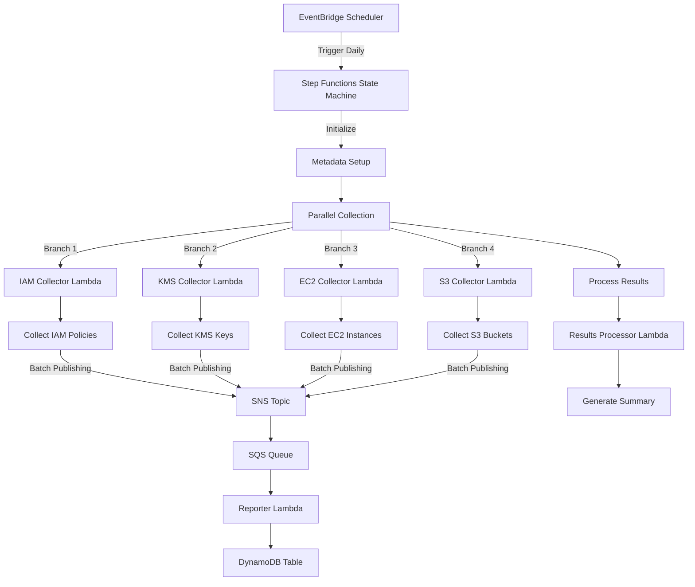
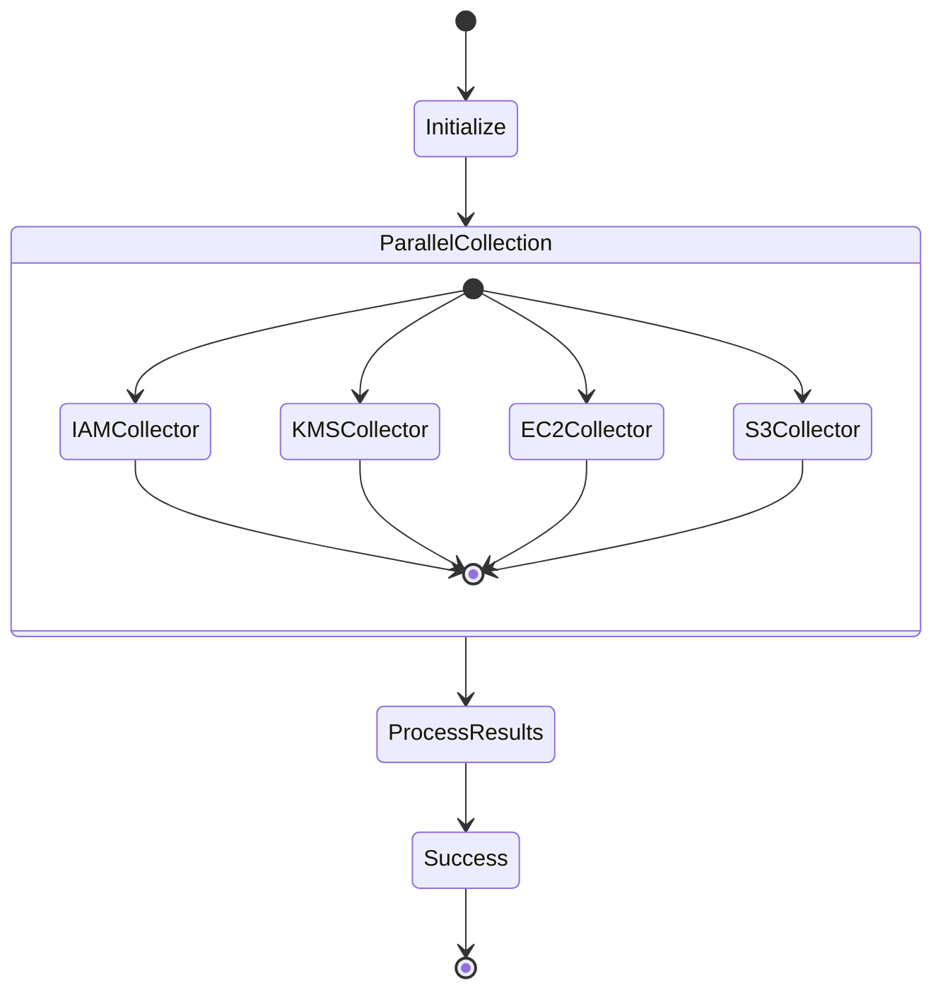
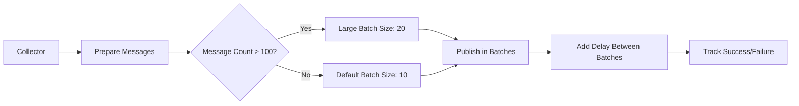
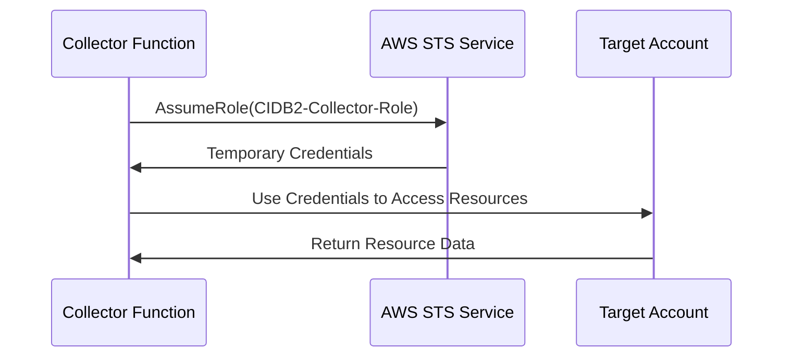
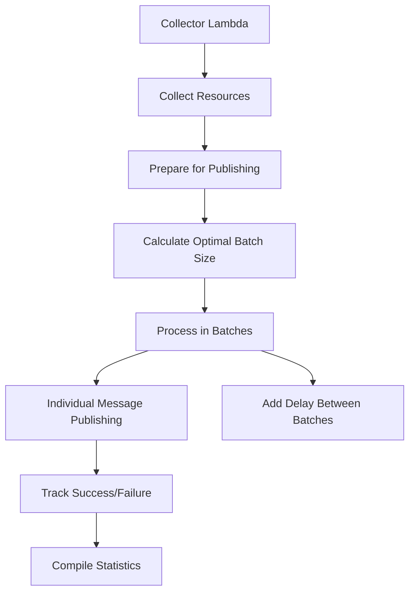
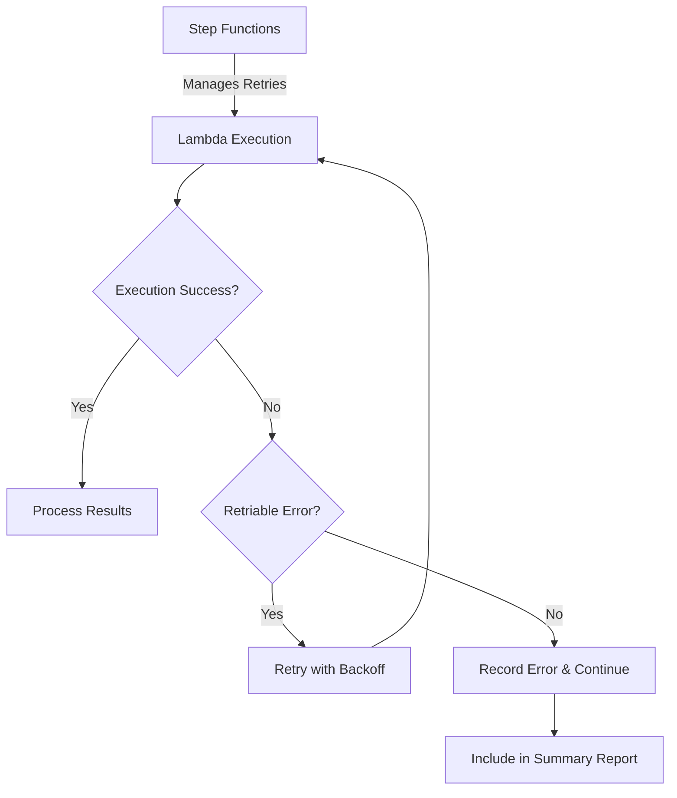

# CIDB2 Multi-Account Inventory Collection System

This module implements an enhanced CIDB2 (Cloud Infrastructure Database 2.0) system for collecting and processing AWS resource inventory across multiple AWS accounts. The implementation includes improved SNS message batching for better performance and a Step Functions orchestration layer for reliable multi-account operations.

## Architecture Overview

The system uses AWS Step Functions to orchestrate parallel Lambda executions across multiple AWS accounts and services, with optimized SNS message batching for efficient data processing.



## Key Components

### Step Functions Orchestration

The Step Functions state machine coordinates the parallel execution of service-specific collector Lambdas and processes their results:



### Enhanced SNS Message Batching

The implementation includes optimized SNS message batching to improve performance when publishing large numbers of messages:



## Implementation Details

### 1. Multi-Account Access

The system assumes a cross-account role to collect data from multiple AWS accounts:



### 2. SNS Batch Publishing Process

The enhanced SNS batch publishing process:



## Infrastructure Components

The system consists of these main infrastructure components:

1. **AWS Lambda Functions**:
   - Service-specific collector Lambdas (IAM, KMS, EC2, S3)
   - Results processor Lambda

2. **AWS Step Functions**:
   - Orchestration state machine for parallel execution

3. **Messaging & Queuing**:
   - SNS topic for publishing inventory data
   - SQS queue for processing inventory messages

4. **Scheduling**:
   - EventBridge scheduler for triggering the workflow

## Configuration

Key configuration parameters:

| Parameter | Description | Default |
|-----------|-------------|---------|
| `default_batch_size` | Default SNS batch size | 10 |
| `large_batch_size` | Batch size for large volumes | 20 |
| `large_batch_threshold` | Threshold for large batch | 100 |
| `inventory_schedule_expression` | Schedule expression | `rate(1 day)` |

## Performance Improvements

The implementation includes several performance optimizations:

1. **Parallel Processing**: Service-specific collectors run in parallel
2. **Batch Processing**: Messages are published in batches to reduce API calls
3. **Dynamic Batch Sizing**: Batch size adapts based on message volume
4. **Cross-Account Efficiency**: Optimized role assumption and credential caching
5. **Error Isolation**: Service-specific failures don't impact other services

## Error Handling Strategy



## Setup Instructions

1. Deploy the Terraform module:
   ```bash
   terraform init
   terraform apply
   ```

2. Configure target accounts:
   - Ensure the `CIDB2-Collector-Role` exists in each account
   - Role must trust the collector account

3. Customize the Step Functions input:
   ```json
   {
     "accounts": ["123456789012", "234567890123"],
     "config": {
       "batch_size": 10,
       "large_batch_size": 20,
       "large_batch_threshold": 100,
       "sns_topic_arn": "arn:aws:sns:..."
     }
   }
   ```

## Monitoring and Observability

The system includes comprehensive logging and monitoring:

1. **Lambda Function Logs**: Detailed operation logs in CloudWatch
2. **Step Functions Execution Logs**: Workflow execution details
3. **X-Ray Tracing**: End-to-end request tracing
4. **SNS/SQS Metrics**: Message throughput and error rates

## Security Considerations

The implementation includes several security features:

1. **IAM Least Privilege**: Minimal IAM permissions for each component
2. **Cross-Account Security**: Secure cross-account access patterns
3. **Data Encryption**: SNS/SQS encryption in transit and at rest
4. **Audit Logging**: Comprehensive audit trail for all operations

## Conclusion

This enhanced CIDB2 implementation delivers significant improvements in performance, reliability, and scalability for multi-account AWS inventory collection through optimized SNS batching and Step Functions orchestration.
