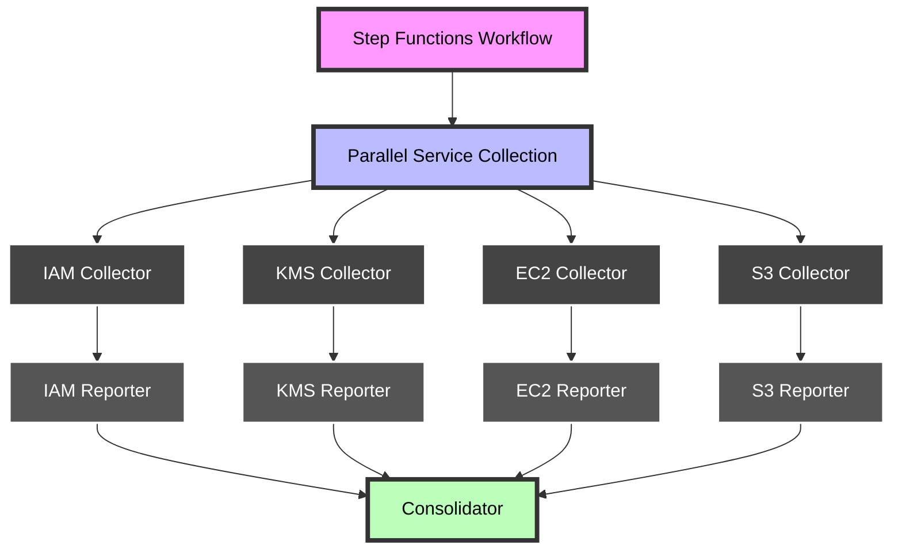
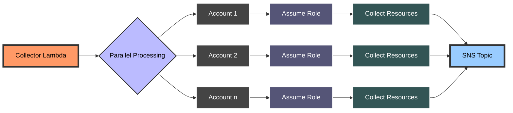
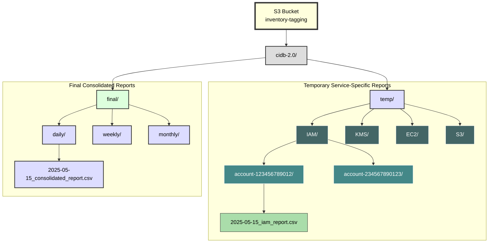

# CIDB 2.0 Multi-Account Architecture

## ⚠️ IMPORTANT: Performance Improvements Needed

This multi-account implementation **does not yet include the performance improvements** that have been implemented in the pre-multiaccount version. The following critical improvements need to be synced to this version:

1. **Lambda Configuration Updates**:
   - Increase Lambda timeouts from 20/300 seconds to 900 seconds (15 minutes)
   - Increase memory allocation from 512MB to 1024MB

2. **SQS Batch Processing**:
   - Increase batch size from 1 to 25 messages
   - Add a 30-second batching window

3. **Code Enhancements**:
   - Update message batch processing to handle multiple messages efficiently
   - Improve error handling for individual message failures
   - Implement detailed, contextual logging

4. **S3 Locking Configuration**:
   - Add environment variables for locking parameters (LOCK_TIMEOUT_SECONDS, etc.)
   - Implement improved locking with retry logic

These improvements are essential for handling large volumes of data (1500+ IAM policies) and should be applied to this multiaccount version to maintain consistent performance characteristics with the pre-multiaccount implementation.

## Overview

The CIDB 2.0 Multi-Account architecture is an enhanced version of the original inventory tagging system. It's designed to efficiently collect, process, and report on AWS resources across multiple accounts and services at scale. This implementation focuses on maintaining the original application code structure while introducing service-specific processing, improved error handling, and enhanced scalability.



## Key Improvements

### 1. Service-Specific Architecture

The new architecture separates resource collection by service type (IAM, KMS, EC2, S3), allowing for:

- **Independent Scaling**: Each service can be scaled based on its specific needs
- **Reduced Lambda Timeouts**: By focusing on one service at a time, we reduce the risk of timeouts
- **Parallel Processing**: Services can be processed concurrently, reducing overall execution time
- **Better Error Isolation**: Issues with one service won't affect others

### 2. Multi-Account Support

Enhanced to efficiently handle large-scale resource collection across multiple AWS accounts:

- **Concurrent Account Processing**: Configurable concurrency limits for account processing
- **Cross-Account Role Assumption**: Streamlined process for assuming roles across accounts
- **Account-Level Error Handling**: Better isolation of account-specific issues
- **Configurable Account Lists**: Support for environment variable or event-based account lists



### 3. Step Functions Orchestration

A new Step Functions workflow orchestrates the entire process:

- **Parallel Execution**: Collects from different services simultaneously
- **Coordinated Waiting**: Ensures all processing is complete before consolidation
- **Error Handling**: Built-in retry logic and error state transitions
- **Visualization**: Provides visibility into the execution flow and status

```mermaid
stateDiagram-v2
    [*] --> ParallelServiceCollection
    ParallelServiceCollection --> WaitForMessageProcessing: "All service collections complete"
    WaitForMessageProcessing --> RunConsolidator: "Wait 5 minutes"
    
    RunConsolidator --> WorkflowComplete: Success
    RunConsolidator --> WorkflowCompleteWithErrors: Failure
    
    state ParallelServiceCollection {
        state "Service Collections" as parallel <<fork>>
        parallel: Runs all service collectors in parallel
        
        [*] --> parallel
        
        parallel --> IAMCollection
        parallel --> KMSCollection
        parallel --> EC2Collection
        parallel --> S3Collection
        
        state IAMCollection {
            description: "IAM Resource Collection"
        }
        
        state KMSCollection {
            description: "KMS Resource Collection"
        }
        
        state EC2Collection {
            description: "EC2 Resource Collection"
        }
        
        state S3Collection {
            description: "S3 Resource Collection"
        }
        
        IAMCollection --> IAMSuccess: Success
        IAMCollection --> IAMFailure: "Failure (retry 2x)"
        
        KMSCollection --> KMSSuccess: Success
        KMSCollection --> KMSFailure: "Failure (retry 2x)"
        
        EC2Collection --> EC2Success: Success
        EC2Collection --> EC2Failure: "Failure (retry 2x)"
        
        S3Collection --> S3Success: Success
        S3Collection --> S3Failure: "Failure (retry 2x)"
    }
    
    note right of WaitForMessageProcessing: "Allows time for SQS/SNS message processing"
    note right of RunConsolidator: "Merges all service reports"
    
    state WorkflowComplete {
        description: "All resources collected and consolidated successfully"
    }
    
    state WorkflowCompleteWithErrors {
        description: "Some services failed but workflow completed"
    }
    
    WorkflowComplete --> [*]
    WorkflowCompleteWithErrors --> [*]
```

### 4. Improved Error Handling

Enhanced error handling mechanisms throughout the system:

- **Circuit Breaker Pattern**: Prevents cascading failures when services are unavailable
- **Structured Error Reporting**: Consistent error format across all components
- **Retries with Backoff**: Intelligent retry logic for transient failures
- **CloudWatch Alarms**: Monitoring for critical error conditions

### 5. Consolidated Reporting

The new Consolidator Lambda function:

- **Merges Service Reports**: Combines service-specific CSV files into a single report
- **Optimized Storage**: Organizes S3 storage by service, account, and date
- **Report Format Consistency**: Ensures consistent formatting across all services
- **Historical Data Access**: Maintains historical reports in an organized hierarchy



### 6. S3 Storage Organization

The S3 storage is organized in a hierarchical structure to facilitate efficient access and management of reports.

## Component Overview

### Collector Lambda

- **Purpose**: Collects resources from AWS accounts based on service type
- **Concurrency**: Processes multiple accounts in parallel
- **Configuration**: Service-specific via environment variables
- **Output**: Publishes resources to service-specific SNS topics

### Reporter Lambda

- **Purpose**: Processes service-specific messages from SQS
- **Functionality**: Creates CSV reports for each service and account
- **Storage**: Organizes reports in S3 with a structured prefix hierarchy
- **Integration**: Indicates completion for the consolidation step

### Consolidator Lambda

- **Purpose**: Merges service-specific reports into a final consolidated report
- **Processing**: Combines data from multiple service reports
- **Output**: Produces a unified CSV with consistent formatting
- **Cleanup**: Optionally removes temporary service-specific reports

### Step Functions Workflow

- **Orchestration**: Manages the entire workflow from collection to consolidation
- **Parallelism**: Runs service collections concurrently
- **Error Handling**: Provides retry capabilities and failure tracking
- **Status Tracking**: Maintains state information throughout the process

## Environment Variables

### Collector Lambda

- `SERVICE_TYPE`: Type of service to collect (IAM, KMS, EC2, S3)
- `SNS_TOPIC_ARN`: ARN of the service-specific SNS topic
- `ACCOUNTS`: Comma-separated list or JSON array of account IDs
- `ASSUME_ROLE`: Role name to assume in target accounts
- `MAX_ACCOUNTS_CONCURRENCY`: Number of accounts to process concurrently
- `MAX_WORKERS`: Maximum number of worker threads for resource processing

### Reporter Lambda

- `SERVICE_TYPE`: Type of service being reported
- `BUCKET_NAME`: S3 bucket for storing reports
- `TEMP_PREFIX`: Prefix for temporary report storage
- `FINAL_PREFIX`: Prefix for final report storage

### Consolidator Lambda

- `BUCKET_NAME`: S3 bucket containing service reports
- `PREFIX`: Base prefix for all reports
- `SERVICES`: JSON array of services to consolidate

## Service-Specific Implementation

### IAM Resources

The implementation for IAM includes:
- Policy collection across multiple accounts
- Tag management for IAM policies
- Detailed policy properties reporting

### KMS Resources

The implementation for KMS includes:
- Key collection across multiple accounts
- Tag management for KMS keys
- Key usage and rotation status tracking

### EC2 Resources

The implementation for EC2 includes:
- Instance inventory across multiple accounts
- Tag management for EC2 instances
- Instance type and state reporting

### S3 Resources

The implementation for S3 includes:
- Bucket inventory across multiple accounts
- Tag management for S3 buckets
- Bucket policy and encryption status reporting

## Getting Started

### Prerequisites

- AWS account with appropriate permissions
- Terraform for infrastructure deployment
- Python 3.9 or later

### Deployment

To deploy the CIDB 2.0 Multi-Account architecture:

1. Update the required variables in the `terraform.tfvars` file
2. Run Terraform commands to deploy:
   ```
   terraform init
   terraform plan
   terraform apply
   ```

### Execution

The Step Functions workflow can be triggered:
- On a schedule using EventBridge rules
- Manually through the AWS Management Console
- Via the AWS CLI or SDKs

## Security Considerations

- **IAM Roles**: Uses least privilege IAM roles for all components
- **Cross-Account Access**: Securely assumes roles across accounts
- **Data Protection**: Ensures sensitive data is properly handled
- **Monitoring**: CloudWatch alarms for security-related events

## Performance Optimization

- **Concurrency Control**: Configurable parameters for parallel processing
- **Circuit Breakers**: Prevents resource exhaustion during failures
- **Batch Processing**: Efficient handling of large data volumes
- **S3 Organization**: Optimized storage structure for quick access

## Monitoring and Troubleshooting

- **CloudWatch Logs**: Detailed logging for all Lambda functions
- **CloudWatch Metrics**: Performance and error metrics
- **CloudWatch Alarms**: Notifications for critical conditions
- **X-Ray Tracing**: Optional distributed tracing for debugging

## Future Enhancements

- **Additional Services**: Support for more AWS services
- **Custom Resource Handlers**: Extensible framework for custom resource types
- **Advanced Reporting**: Enhanced reporting capabilities and visualizations
- **Cost Optimization**: Refined resource utilization and cost reduction strategies

## Contributing

When contributing to this project, please follow the existing code structure and patterns. The core design principle is to maintain the original application code while enhancing the infrastructure for multi-account operations.
