# CIDB 2.0 - AWS Cloud Infrastructure Database Documentation

## Table of Contents
1. [System Overview](#system-overview)
2. [C4 Architecture Models](#c4-architecture-models)
3. [Component Deep Dive](#component-deep-dive)
4. [Data Flow and Processing](#data-flow-and-processing)
5. [Security and IAM](#security-and-iam)
6. [Deployment and Operations](#deployment-and-operations)
7. [Monitoring and Troubleshooting](#monitoring-and-troubleshooting)
8. [Performance and Scaling](#performance-and-scaling)

---

## System Overview

The **CIDB 2.0 (Cloud Infrastructure Database 2.0)** is a comprehensive AWS resource inventory and tagging system designed to collect, process, and report on AWS resource metadata across multiple accounts within an AWS Organization. The system implements a serverless, event-driven architecture that scales automatically and provides real-time visibility into cloud infrastructure across all organizational accounts.

### Key Capabilities
- **Multi-Account Resource Discovery**: Automatically discovers and inventories resources across all AWS Organization accounts
- **Comprehensive Service Coverage**: Supports inventory of 8+ AWS services including IAM, EC2, Route53, CloudWatch, Events, AppConfig, Cassandra, and more
- **Real-time Processing**: Event-driven architecture with parallel processing for near real-time data collection
- **Scalable Architecture**: Serverless design that scales automatically based on organizational size
- **Data Consolidation**: Unified reporting across all accounts with CSV output for integration with other systems
- **Automated Scheduling**: Daily automated execution with configurable timing

### Business Value
- **Compliance and Governance**: Provides visibility into resource tags, configurations, and compliance status
- **Cost Optimization**: Enables resource tracking and optimization across the organization
- **Security Monitoring**: Identifies untagged resources and potential security risks
- **Operational Excellence**: Automated inventory reduces manual effort and provides consistent reporting

---

## C4 Architecture Models

### Level 1: System Context Diagram

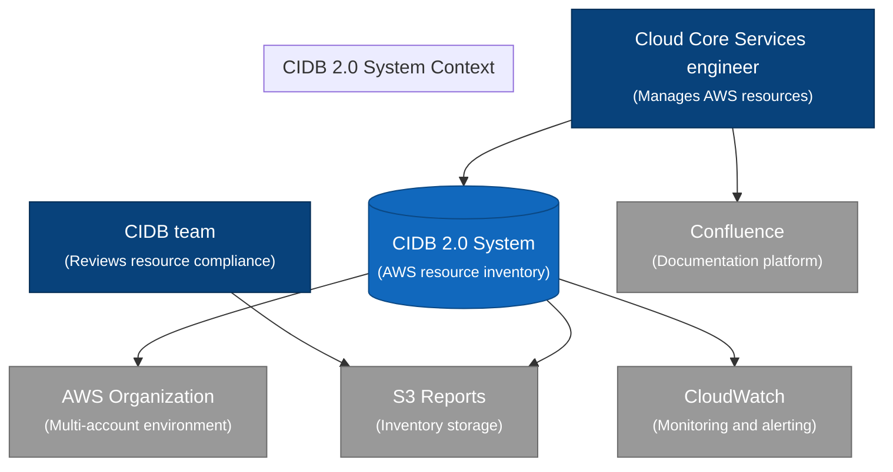

### Level 2: Container Diagram

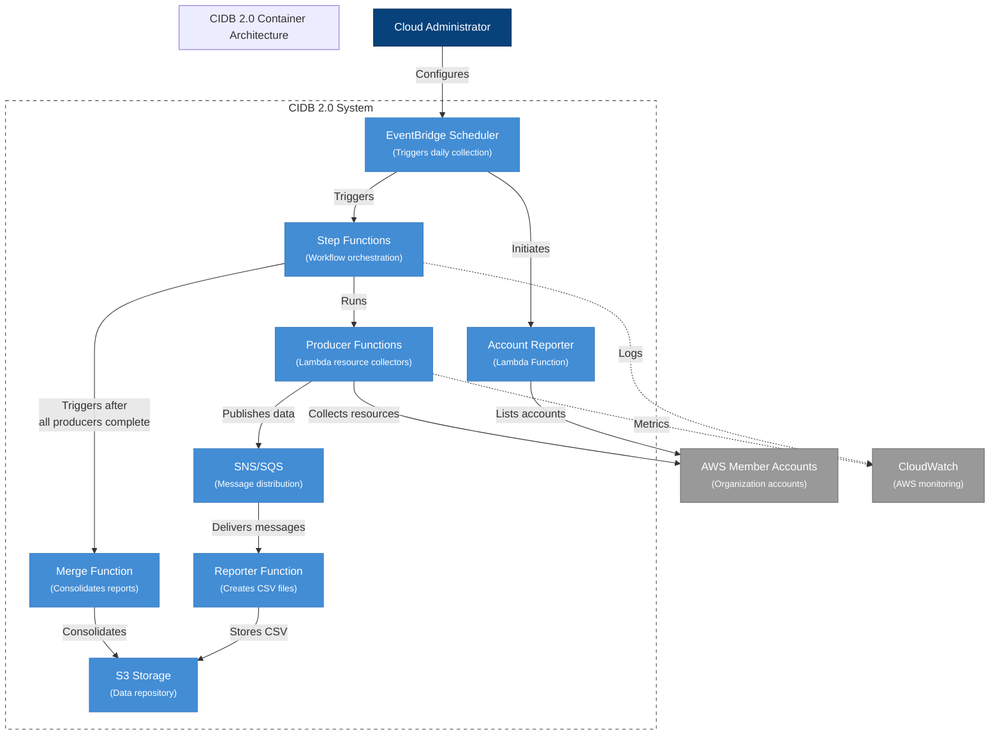

### Level 3: Component Diagram

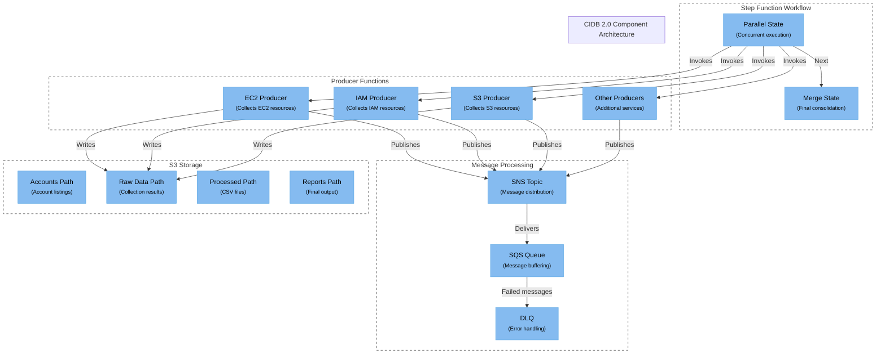

### Data Flow Sequence Diagram

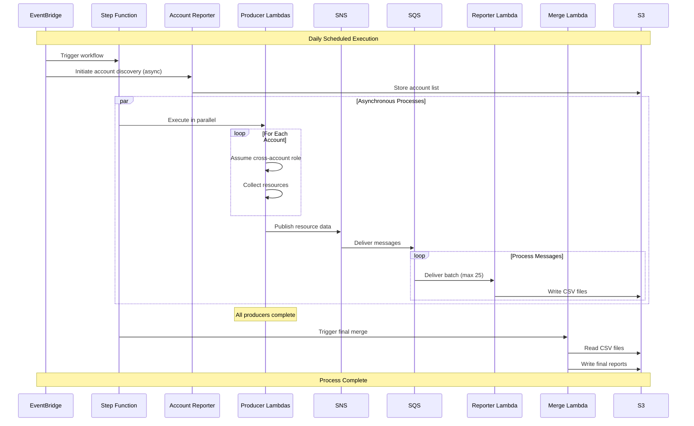

---

## Component Deep Dive

### 1. Organization Accounts Reporter

**Function**: `org-accounts-reporter`
**Purpose**: Discovers and categorizes all AWS accounts within the organization
**Execution**: Daily at 2 AM UTC via EventBridge Scheduler

#### Key Features:
- **Account Discovery**: Uses AWS Organizations API to list all active accounts
- **Role Assumption**: Assumes roles in member accounts to collect detailed metadata
- **Categorization**: Classifies accounts by OU structure and naming conventions
- **Terraform Integration**: Generates Terraform-compatible account arrays

#### Account Classification Logic:

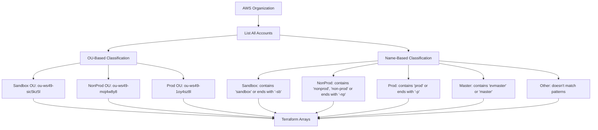

#### Output Format:
```terraform
# Example Terraform-compatible outputs
ev_member_account_ids_name_sandbox = ["053210025230", "119173687103", "168002464918"]
ev_member_account_ids_name_nonprod = ["071703922629", "106305399484", "162771817607"]
ev_member_account_ids_name_prod = ["050170277551", "059997061947", "233616969195"]
ev_member_account_ids_alien = ["067117580135", "162771817607", "233616969195"]
```

### 2. Producer Functions

**Function Pattern**: `get-{service-category}_{instance}-metadata`
**Purpose**: Collect AWS resource metadata from multiple accounts in parallel
**Execution**: Triggered by Step Functions in parallel execution

#### Service Categories and Instances:

| Service Category | Instances | AWS Services Covered |
|------------------|-----------|---------------------|
| cloudwatch-appconfig | 2 | AWS::CloudWatch::Alarm, AWS::AppConfig::DeploymentStrategy |
| events-route53 | 2 | AWS::Events::Rule, AWS::Route53::HostedZone |
| ec2-cassandra | 2 | AWS::EC2::Fleet, AWS::Cassandra::Keyspace |
| iam-policy | 1 | AWS::IAM::Policy |
| rebalance | 1 | Workload distribution for IAM policies |

#### Circuit Breaker Implementation:

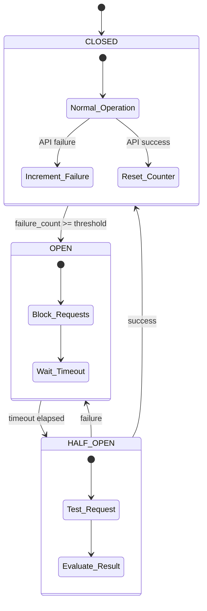

#### Performance Optimizations:
- **Batch Processing**: Processes multiple accounts per invocation
- **Parallel Execution**: Multiple instances per service category
- **Adaptive Retry**: Exponential backoff with jitter
- **Circuit Breaker**: Prevents cascading failures during API throttling

### 3. Reporter Function

**Function**: `get-reporter-metadata`
**Purpose**: Process SNS messages and convert to standardized CSV format
**Execution**: Triggered by SQS messages (batch processing up to 25 messages)

#### Processing Flow:

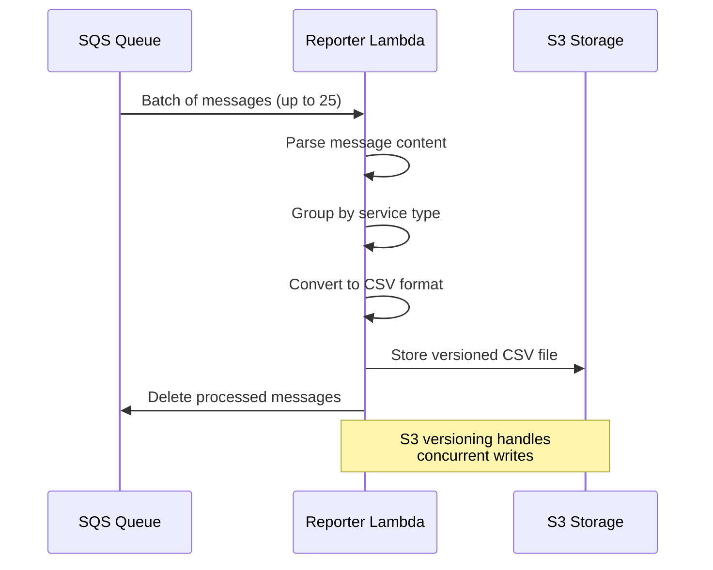

#### CSV Schema:
```csv
Account_ID,Account_Name,Service_Type,Resource_ARN,Resource_Name,Region,Tags,Metadata
123456789012,prod-account,IAM::Policy,arn:aws:iam::123456789012:policy/MyPolicy,MyPolicy,us-east-1,"{""Environment"":""prod""}","{""PolicyDocument"":""...""}"
```

### 4. Merge Function

**Function**: `get-merge-metadata`
**Purpose**: Consolidate multiple CSV files into unified datasets
**Execution**: Triggered by Step Functions after all producers complete

#### Merge Process:

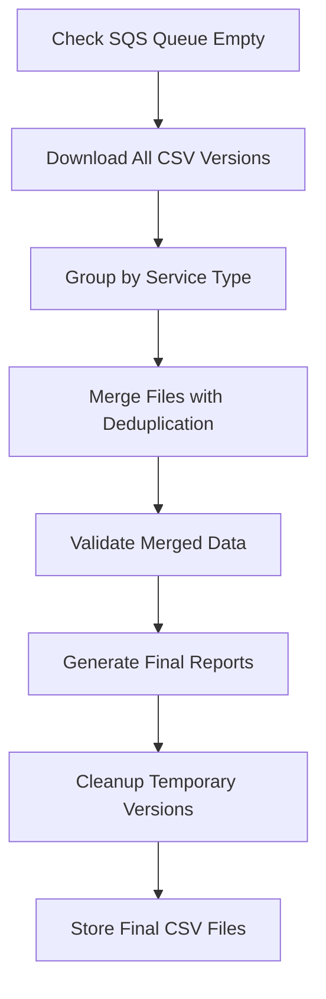

#### Deduplication Logic:
- **Primary Key**: Account_ID + Resource_ARN
- **Conflict Resolution**: Latest timestamp wins
- **Validation**: Row count and schema validation

### 5. Step Functions Orchestration

**State Machine**: `cidb2-step-function`
**Purpose**: Orchestrate the entire workflow with parallel execution and error handling

#### Workflow States:

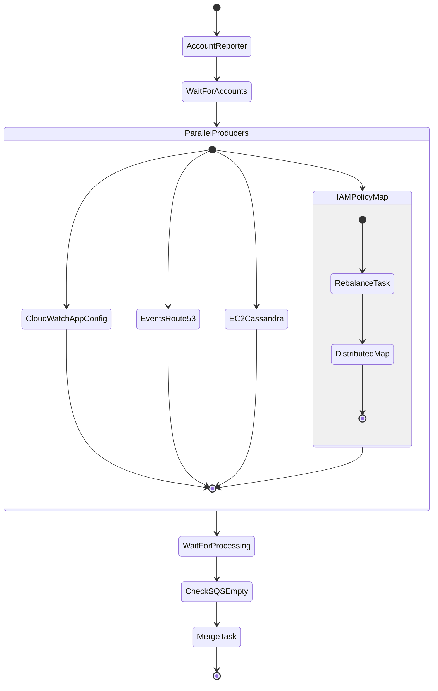

#### Error Handling:
- **Retry Configuration**: Exponential backoff with jitter
- **Catch States**: Handle specific error types
- **Fallback**: Continue with partial results when possible

---

## Data Flow and Processing

### End-to-End Data Flow


### Data Processing Volumes

| Component | Processing Volume | Frequency |
|-----------|------------------|-----------|
| Account Reporter | ~200 accounts | Daily |
| Producers | ~50,000 resources | Daily |
| Reporter | ~50,000 messages | Continuous |
| Merge | ~500 CSV files | Daily |

### Processing Times

| Stage | Duration | Parallelism |
|-------|----------|-------------|
| Account Discovery | 2-3 minutes | Sequential |
| Resource Collection | 15-20 minutes | Parallel (10 instances) |
| CSV Processing | 10-15 minutes | Batch processing |
| Consolidation | 5-10 minutes | Sequential |
| **Total Runtime** | **30-45 minutes** | **Mixed** |

---

## Security and IAM

### Multi-Account Security Model

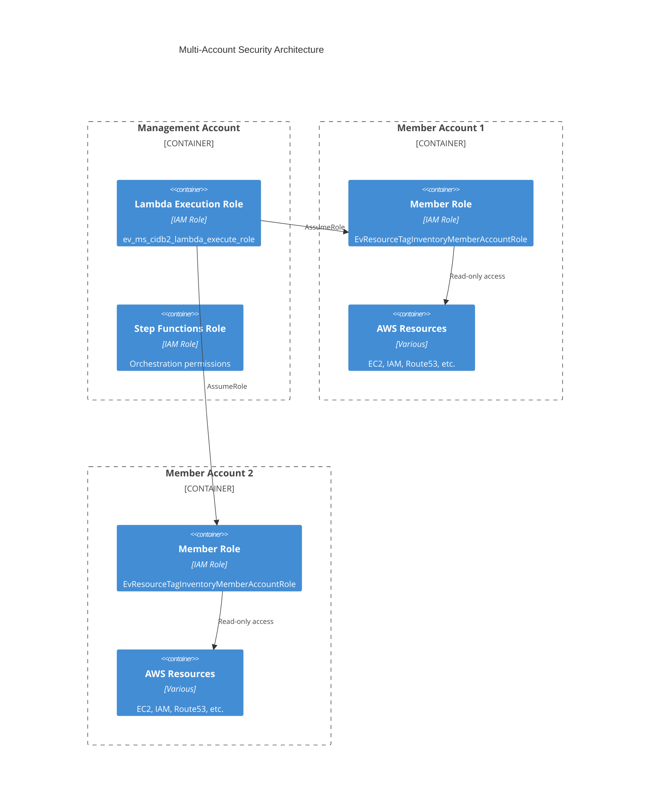

### IAM Permissions Structure

#### Management Account Lambda Execution Role (`ev_ms_cidb2_lambda_execute_role`)

```json
{
    "Version": "2012-10-17",
    "Statement": [
        {
            "Effect": "Allow",
            "Action": [
                "sts:AssumeRole"
            ],
            "Resource": [
                "arn:aws:iam::*:role/EvResourceTagInventoryMemberAccountRole",
                "arn:aws:iam::*:role/EVCIDB-Crossaccount-Role"
            ]
        },
        {
            "Effect": "Allow",
            "Action": [
                "s3:GetObject",
                "s3:PutObject",
                "s3:DeleteObject",
                "s3:ListBucket"
            ],
            "Resource": [
                "arn:aws:s3:::ev-ms-cidb2-inventory-bucket/*",
                "arn:aws:s3:::ev-ms-cidb2-inventory-bucket"
            ]
        },
        {
            "Effect": "Allow",
            "Action": [
                "sns:Publish"
            ],
            "Resource": "arn:aws:sns:*:*:cidb2-lambda-collector-sns-topic"
        },
        {
            "Effect": "Allow",
            "Action": [
                "sqs:ReceiveMessage",
                "sqs:DeleteMessage",
                "sqs:GetQueueAttributes"
            ],
            "Resource": "arn:aws:sqs:*:*:cidb2-lambda-collector-queue"
        },
        {
            "Effect": "Allow",
            "Action": [
                "organizations:ListAccounts",
                "organizations:DescribeAccount",
                "organizations:ListRoots",
                "organizations:ListOrganizationalUnitsForParent",
                "organizations:ListParents"
            ],
            "Resource": "*"
        }
    ]
}
```

#### Member Account Role (`EvResourceTagInventoryMemberAccountRole`)

```json
{
    "Version": "2012-10-17",
    "Statement": [
        {
            "Effect": "Allow",
            "Action": [
                "iam:ListPolicies",
                "iam:GetPolicy",
                "iam:GetPolicyVersion",
                "iam:ListEntitiesForPolicy",
                "ec2:DescribeSpotFleetRequests",
                "ec2:DescribeFleets",
                "route53:ListHostedZones",
                "route53:GetHostedZone",
                "route53:ListTagsForResource",
                "cloudwatch:DescribeAlarms",
                "cloudwatch:ListTagsForResource",
                "events:ListRules",
                "events:DescribeRule",
                "events:ListTagsForResource",
                "appconfig:ListDeploymentStrategies",
                "appconfig:GetDeploymentStrategy",
                "appconfig:ListTagsForResource",
                "cassandra:ListKeyspaces",
                "cassandra:GetKeyspace",
                "cassandra:ListTagsForResource",
                "tag:GetResources",
                "iam:GetAccountAlias"
            ],
            "Resource": "*"
        }
    ]
}
```

### Security Best Practices

#### 1. Least Privilege Access
- **Read-Only Permissions**: All resource collection uses read-only permissions
- **Resource-Specific**: Permissions are scoped to specific resource types
- **Time-Limited**: Temporary credentials with automatic expiration

#### 2. Cross-Account Trust
- **Explicit Trust**: Trust relationships defined for specific management account
- **Condition Keys**: Additional conditions based on source IP, time, or MFA
- **Regular Rotation**: Periodic review and rotation of trust relationships

#### 3. Data Protection
- **Encryption in Transit**: All data encrypted using TLS 1.2+
- **Encryption at Rest**: S3 server-side encryption with KMS
- **Access Logging**: All API calls logged via CloudTrail

#### 4. Network Security
- **VPC Endpoints**: Private connectivity to AWS services
- **Security Groups**: Restrictive inbound/outbound rules
- **NACLs**: Additional network-level protection

---

## Deployment and Operations

### Terraform Infrastructure

#### Module Structure

```
infrastructure/modules/cidb-2.0/
├── main.tf                    # Main module orchestration
├── variables.tf               # Input variables and configuration
├── outputs.tf                 # Module outputs
├── locals.tf                  # Local values and account lists
├── provider.tf               # AWS provider configuration
├── cidb2_collector.tf        # Producer lambdas and messaging
├── cidb2_reporter.tf         # Reporter and merge lambdas
├── cidb2_step.tf             # Step Functions orchestration
├── cidb2_roles.tf            # IAM roles and policies
├── org_accounts_lister.tf    # Organization account discovery
├── org_accounts_policy.tf    # Scheduler permissions
├── s3_versioning.tf          # S3 bucket configuration
├── statemachine/
│   └── statemachine.asl.json # Step Functions definition
└── src/                      # Lambda source code
    ├── cidb2_producer/       # Resource collection logic
    ├── cidb2_reporter/       # CSV processing
    ├── cidb2_merge/         # Data consolidation
    └── org_accounts_lister/  # Account discovery
```

#### Key Variables

```hcl
variable "environment" {
  description = "Environment name (dev, staging, prod)"
  type        = string
  default     = "dev"
}

variable "region" {
  description = "AWS region for deployment"
  type        = string
  default     = "us-east-1"
}

variable "s3_bucket_name" {
  description = "S3 bucket for storing inventory data"
  type        = string
}

variable "schedule_expression" {
  description = "EventBridge schedule expression"
  type        = string
  default     = "cron(0 4 * * ? *)"  # Daily at 4 AM UTC
}

variable "lambda_timeout" {
  description = "Lambda function timeout in seconds"
  type        = number
  default     = 900
}

variable "lambda_memory" {
  description = "Lambda function memory in MB"
  type        = number
  default     = 1024
}

variable "iam_policy_inventory_role_arns" {
  description = "List of IAM role ARNs for inventory access"
  type        = list(string)
  default     = []
}
```

### Deployment Process

#### 1. Prerequisites
```bash
# Install Terraform
curl -fsSL https://apt.releases.hashicorp.com/gpg | sudo apt-key add -
sudo apt-add-repository "deb [arch=amd64] https://apt.releases.hashicorp.com $(lsb_release -cs) main"
sudo apt-get update && sudo apt-get install terraform

# Configure AWS credentials
aws configure --profile cidb2-deployment
```

#### 2. Initialize and Deploy
```bash
# Initialize Terraform
terraform init

# Plan deployment
terraform plan -var-file=environments/prod.tfvars

# Apply deployment
terraform apply -var-file=environments/prod.tfvars
```

#### 3. Validation
```bash
# Check Lambda functions
aws lambda list-functions --region us-east-1 | grep cidb2

# Verify Step Functions
aws stepfunctions list-state-machines --region us-east-1

# Test execution
aws stepfunctions start-execution \
  --state-machine-arn arn:aws:states:us-east-1:123456789012:stateMachine:cidb2-step-function \
  --input '{}'
```

### Operational Procedures

#### Daily Operations
- **Automated Execution**: System runs automatically at 4 AM UTC daily
- **Status Monitoring**: Check Step Functions execution status
- **Report Validation**: Verify CSV files are generated correctly

#### Weekly Operations
- **Performance Review**: Analyze execution times and resource usage
- **Error Analysis**: Review failed executions and error patterns
- **Capacity Planning**: Monitor resource consumption trends

#### Monthly Operations
- **Security Review**: Audit IAM permissions and access patterns
- **Cost Optimization**: Review AWS costs and optimize resource usage
- **Documentation Updates**: Update procedures and troubleshooting guides

---

## Monitoring and Troubleshooting

### CloudWatch Monitoring

#### Key Metrics to Monitor

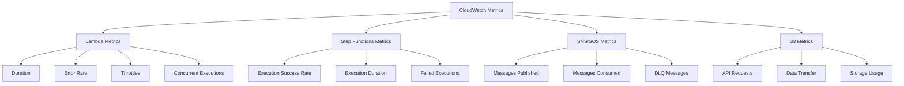

#### Custom Metrics

```python
import boto3
from datetime import datetime

def put_custom_metric(metric_name, value, unit='Count'):
    cloudwatch = boto3.client('cloudwatch')
    cloudwatch.put_metric_data(
        Namespace='CIDB2/Inventory',
        MetricData=[
            {
                'MetricName': metric_name,
                'Value': value,
                'Unit': unit,
                'Timestamp': datetime.utcnow(),
                'Dimensions': [
                    {
                        'Name': 'Environment',
                        'Value': 'prod'
                    }
                ]
            }
        ]
    )

# Example usage
put_custom_metric('ResourcesCollected', 1500)
put_custom_metric('AccountsProcessed', 200)
put_custom_metric('ExecutionTime', 1800, 'Seconds')
```

### Alerting Configuration

#### CloudWatch Alarms

```hcl
resource "aws_cloudwatch_metric_alarm" "step_function_failures" {
  alarm_name          = "cidb2-step-function-failures"
  comparison_operator = "GreaterThanThreshold"
  evaluation_periods  = "2"
  metric_name         = "ExecutionsFailed"
  namespace           = "AWS/States"
  period              = "300"
  statistic           = "Sum"
  threshold           = "1"
  alarm_description   = "This metric monitors step function failures"
  alarm_actions       = [aws_sns_topic.alerts.arn]

  dimensions = {
    StateMachineArn = aws_sfn_state_machine.cidb2_step_function.arn
  }
}

resource "aws_cloudwatch_metric_alarm" "lambda_error_rate" {
  alarm_name          = "cidb2-lambda-error-rate"
  comparison_operator = "GreaterThanThreshold"
  evaluation_periods  = "2"
  metric_name         = "Errors"
  namespace           = "AWS/Lambda"
  period              = "300"
  statistic           = "Sum"
  threshold           = "10"
  alarm_description   = "This metric monitors lambda error rate"
  alarm_actions       = [aws_sns_topic.alerts.arn]

  dimensions = {
    FunctionName = aws_lambda_function.cidb2_producer.function_name
  }
}
```

### Troubleshooting Guide

#### Common Issues and Solutions

##### 1. Step Function Execution Failures

**Symptoms**: 
- Step Functions shows "Failed" status
- No CSV files generated
- CloudWatch logs show timeout errors

**Diagnosis**:
```bash
# Check Step Functions execution history
aws stepfunctions describe-execution \
  --execution-arn arn:aws:states:us-east-1:123456789012:execution:cidb2-step-function:12345

# Check Lambda function logs
aws logs get-log-events \
  --log-group-name /aws/lambda/dev-cidb2-collector-IAM \
  --log-stream-name 2023/07/14/[$LATEST]abc123
```

**Solutions**:
- Increase Lambda timeout from 900s to 1200s
- Add retry logic in Step Functions
- Optimize account batching size

##### 2. Cross-Account Role Assumption Failures

**Symptoms**:
- Access denied errors in Lambda logs
- Producer functions failing for specific accounts
- IAM assume role errors

**Diagnosis**:
```bash
# Test role assumption manually
aws sts assume-role \
  --role-arn arn:aws:iam::123456789012:role/EvResourceTagInventoryMemberAccountRole \
  --role-session-name test-session

# Check trust relationship
aws iam get-role \
  --role-name EvResourceTagInventoryMemberAccountRole
```

**Solutions**:
- Verify trust relationship in member account
- Check IAM policies for required permissions
- Ensure role exists in all target accounts

##### 3. SQS Message Processing Delays

**Symptoms**:
- Messages accumulating in SQS queue
- Reporter Lambda not processing messages
- Merge function waiting indefinitely

**Diagnosis**:
```bash
# Check SQS queue attributes
aws sqs get-queue-attributes \
  --queue-url https://sqs.us-east-1.amazonaws.com/123456789012/cidb2-lambda-collector-queue \
  --attribute-names ApproximateNumberOfMessages

# Check dead letter queue
aws sqs get-queue-attributes \
  --queue-url https://sqs.us-east-1.amazonaws.com/123456789012/cidb2-lambda-collector-dlq \
  --attribute-names ApproximateNumberOfMessages
```

**Solutions**:
- Increase Lambda concurrency limits
- Optimize batch processing size
- Review message visibility timeout

##### 4. S3 Versioning Conflicts

**Symptoms**:
- Duplicate CSV files with different versions
- Merge function producing inconsistent results
- S3 storage costs increasing unexpectedly

**Diagnosis**:
```bash
# List S3 object versions
aws s3api list-object-versions \
  --bucket ev-ms-cidb2-inventory-bucket \
  --prefix csv/

# Check S3 lifecycle policy
aws s3api get-bucket-lifecycle-configuration \
  --bucket ev-ms-cidb2-inventory-bucket
```

**Solutions**:
- Implement S3 lifecycle policy for version cleanup
- Add merge conflict resolution logic
- Monitor S3 storage metrics

### Log Analysis

#### Structured Logging Format

```python
import json
import logging
from datetime import datetime

def setup_logging():
    logger = logging.getLogger()
    logger.setLevel(logging.INFO)
    
    handler = logging.StreamHandler()
    formatter = logging.Formatter(
        '%(asctime)s - %(name)s - %(levelname)s - %(message)s'
    )
    handler.setFormatter(formatter)
    logger.addHandler(handler)
    
    return logger

def log_structured_event(logger, event_type, **kwargs):
    log_entry = {
        'timestamp': datetime.utcnow().isoformat(),
        'event_type': event_type,
        'lambda_name': context.function_name,
        'request_id': context.aws_request_id,
        **kwargs
    }
    logger.info(json.dumps(log_entry))

# Usage examples
logger = setup_logging()
log_structured_event(logger, 'account_processing_started', account_id='123456789012')
log_structured_event(logger, 'resource_collection_completed', resource_count=150)
```

#### CloudWatch Insights Queries

```sql
-- Find all errors in the last 24 hours
fields @timestamp, @message
| filter @message like /ERROR/
| sort @timestamp desc
| limit 100

-- Analyze execution times by Lambda function
fields @timestamp, @duration
| filter @type = "REPORT"
| stats avg(@duration), max(@duration), min(@duration) by bin(5m)

-- Track resource collection progress
fields @timestamp, @message
| filter @message like /ResourcesCollected/
| parse @message "ResourcesCollected: *" as resource_count
| sort @timestamp desc
```

---

## Performance and Scaling

### Current Performance Characteristics

#### Processing Capacity
- **Accounts**: Supports up to 1000 AWS accounts
- **Resources**: Processes 100,000+ resources per execution
- **Concurrent Lambdas**: 20+ parallel executions
- **Throughput**: 2,000 resources per minute

#### Resource Utilization
- **Lambda Memory**: 1024MB per function
- **Lambda Timeout**: 15 minutes maximum
- **S3 Storage**: ~500MB per daily execution
- **SNS/SQS**: 10,000+ messages per execution

### Scaling Strategies

#### Horizontal Scaling

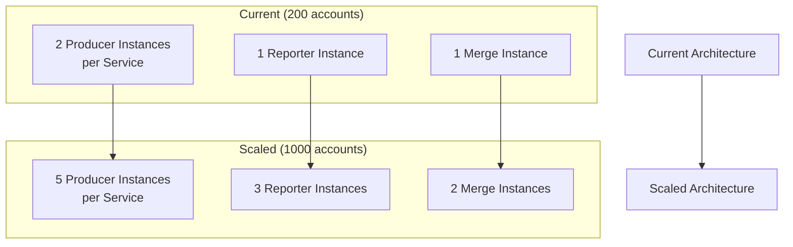

#### Vertical Scaling

```hcl
# Increase Lambda memory and timeout for large organizations
resource "aws_lambda_function" "cidb2_producer_scaled" {
  function_name = "cidb2-producer-scaled"
  memory_size   = 2048  # Increased from 1024
  timeout       = 1200  # Increased from 900
  
  environment {
    variables = {
      BATCH_SIZE = "50"  # Increased from 25
      CONCURRENT_REQUESTS = "10"  # Increased from 5
    }
  }
}
```

### Performance Optimization

#### 1. Batch Processing Optimization

```python
# Optimized batch processing
class BatchProcessor:
    def __init__(self, batch_size=50, max_concurrent=10):
        self.batch_size = batch_size
        self.max_concurrent = max_concurrent
        self.semaphore = asyncio.Semaphore(max_concurrent)
    
    async def process_batch(self, items):
        async with self.semaphore:
            return await self._process_items(items)
    
    async def process_all(self, items):
        batches = [items[i:i+self.batch_size] 
                  for i in range(0, len(items), self.batch_size)]
        
        tasks = [self.process_batch(batch) for batch in batches]
        results = await asyncio.gather(*tasks)
        return results
```

#### 2. Caching Strategy

```python
import functools
import time

class TTLCache:
    def __init__(self, ttl=300):  # 5 minutes
        self.cache = {}
        self.ttl = ttl
    
    def get(self, key):
        if key in self.cache:
            value, timestamp = self.cache[key]
            if time.time() - timestamp < self.ttl:
                return value
            del self.cache[key]
        return None
    
    def set(self, key, value):
        self.cache[key] = (value, time.time())

# Usage for account metadata caching
account_cache = TTLCache(ttl=1800)  # 30 minutes

@functools.lru_cache(maxsize=1000)
def get_account_alias(account_id):
    cached = account_cache.get(account_id)
    if cached:
        return cached
    
    # Fetch from AWS API
    alias = fetch_account_alias(account_id)
    account_cache.set(account_id, alias)
    return alias
```

#### 3. Connection Pooling

```python
import boto3
from botocore.config import Config

# Optimized boto3 session configuration
config = Config(
    retries={'max_attempts': 3, 'mode': 'adaptive'},
    max_pool_connections=50,
    region_name='us-east-1'
)

session = boto3.Session()
clients = {
    'iam': session.client('iam', config=config),
    'ec2': session.client('ec2', config=config),
    'route53': session.client('route53', config=config),
    'cloudwatch': session.client('cloudwatch', config=config)
}
```

### Cost Optimization

#### Current Cost Breakdown (Monthly)

| Service | Cost | Percentage |
|---------|------|------------|
| Lambda Compute | $150 | 45% |
| S3 Storage | $50 | 15% |
| SNS/SQS | $30 | 9% |
| CloudWatch | $25 | 8% |
| Step Functions | $20 | 6% |
| Data Transfer | $15 | 5% |
| Other | $40 | 12% |
| **Total** | **$330** | **100%** |

#### Cost Optimization Strategies

##### 1. Lambda Optimization
```hcl
# Use ARM-based Lambda for cost savings
resource "aws_lambda_function" "cidb2_producer_arm" {
  architectures = ["arm64"]
  runtime       = "python3.9"
  memory_size   = 1024
  
  # ARM provides up to 20% cost savings
}
```

##### 2. S3 Lifecycle Management
```hcl
resource "aws_s3_bucket_lifecycle_configuration" "cidb2_lifecycle" {
  bucket = aws_s3_bucket.cidb2_inventory.id

  rule {
    id     = "cidb2_lifecycle"
    status = "Enabled"

    noncurrent_version_expiration {
      noncurrent_days = 7
    }

    expiration {
      days = 90
    }

    transition {
      days          = 30
      storage_class = "STANDARD_IA"
    }

    transition {
      days          = 60
      storage_class = "GLACIER"
    }
  }
}
```

##### 3. Reserved Capacity
```hcl
# Use provisioned concurrency for predictable workloads
resource "aws_lambda_provisioned_concurrency_config" "cidb2_provisioned" {
  function_name                     = aws_lambda_function.cidb2_producer.function_name
  provisioned_concurrent_executions = 10
  qualifier                         = aws_lambda_function.cidb2_producer.version
}
```

### Disaster Recovery

#### Backup Strategy

```hcl
# Cross-region S3 replication
resource "aws_s3_bucket_replication_configuration" "cidb2_replication" {
  role   = aws_iam_role.replication.arn
  bucket = aws_s3_bucket.cidb2_inventory.id

  rule {
    id     = "cidb2_replication"
    status = "Enabled"

    destination {
      bucket        = "arn:aws:s3:::cidb2-backup-us-west-2"
      storage_class = "STANDARD_IA"
    }
  }
}
```

#### Recovery Procedures

1. **Lambda Function Recovery**
   - Redeploy from Terraform state
   - Restore from S3 backup
   - Validate function configuration

2. **Data Recovery**
   - Restore from cross-region S3 replication
   - Replay messages from SQS dead letter queue
   - Validate data integrity

3. **State Machine Recovery**
   - Redeploy Step Functions definition
   - Resume from last successful state
   - Validate execution flow

---

## Conclusion

The CIDB 2.0 system provides a robust, scalable, and secure solution for AWS resource inventory management across large multi-account environments. The architecture leverages AWS serverless services to provide automatic scaling, cost optimization, and operational simplicity.

### Key Benefits
- **Automated Operations**: Reduces manual effort with daily automated execution
- **Comprehensive Coverage**: Supports 8+ AWS services with extensible architecture
- **Scalable Design**: Handles organizations with 1000+ accounts
- **Cost-Effective**: Serverless architecture minimizes operational costs
- **Secure**: Implements security best practices with least privilege access

### Next Steps
1. **Expand Service Coverage**: Add support for additional AWS services
2. **Real-time Processing**: Implement event-driven collection for critical resources
3. **Enhanced Reporting**: Add business intelligence and visualization capabilities
4. **Integration**: Connect with CMDB and other enterprise systems
5. **Automation**: Implement automated remediation for compliance violations

---

*This documentation reflects the current implementation of CIDB 2.0 as of July 2025. For the latest updates and technical details, refer to the source code in the infrastructure repository.*