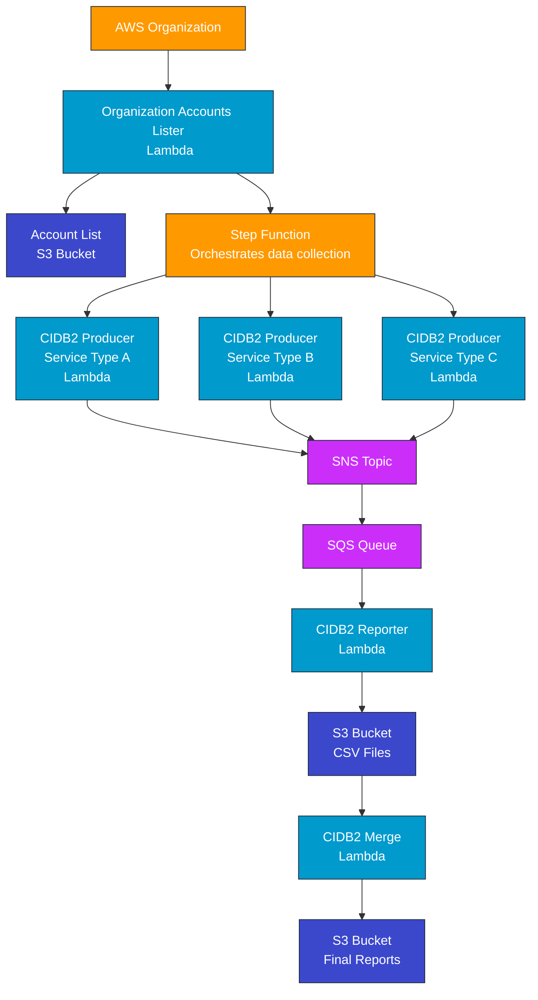
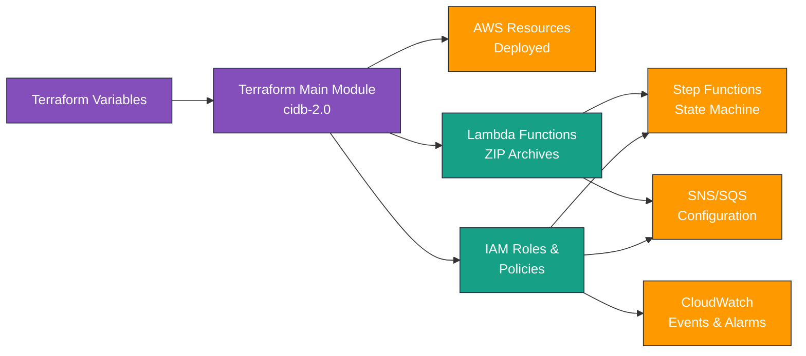
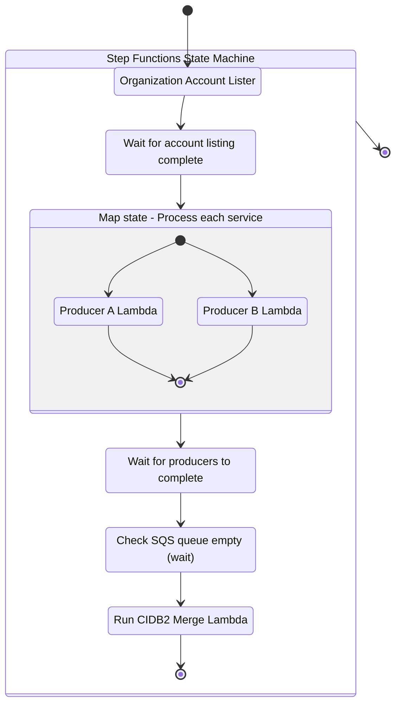
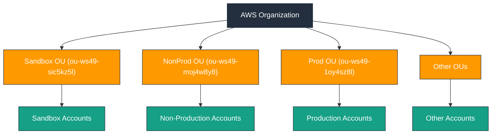
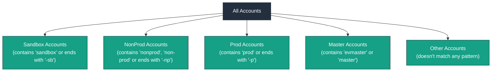
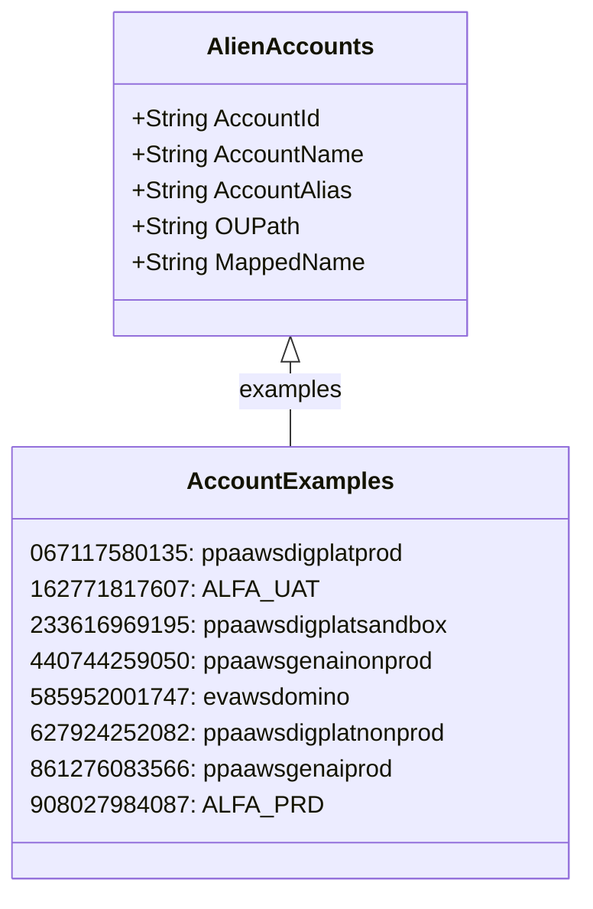

# CIDB-2.0 Lambda Functions Documentation

This document provides an overview of the Lambda functions in the CIDB (Cloud Infrastructure Database) 2.0 system, explaining their purpose, functionality, and how they integrate with each other.

## Table of Contents

1. [System Overview](#system-overview)
2. [Architecture Diagrams](#architecture-diagrams)
   - [System Architecture](#system-architecture)
   - [Terraform Deployment Flow](#terraform-deployment-flow)
   - [Step Functions Workflow](#step-functions-workflow)
3. [Lambda Functions](#lambda-functions)
   - [CIDB2 Producer](#cidb2-producer)
   - [CIDB2 Reporter](#cidb2-reporter)
   - [CIDB2 Merge](#cidb2-merge)
   - [Organization Accounts Lister](#organization-accounts-lister)
4. [Data Flow](#data-flow)
5. [Error Handling](#error-handling)
6. [Deployment Notes](#deployment-notes)

## System Overview

The CIDB-2.0 system is designed to collect, process, and report on AWS resource metadata across multiple accounts in an AWS organization. The system follows a distributed processing architecture with the following components:

1. **Discovery**: Find accounts and their organizational structure
2. **Collection**: Gather resource metadata from discovered accounts
3. **Processing**: Convert raw data to standardized formats
4. **Consolidation**: Merge data from multiple sources
5. **Reporting**: Present unified view of resources

## Architecture Diagrams

### System Architecture



### Terraform Deployment Flow



### Step Functions Workflow



## Lambda Functions

### CIDB2 Producer

**Purpose**: Collects AWS resource metadata and tag information from multiple accounts.

**Key Features**:
- Supports multiple AWS services (IAM, EC2, Route53, CloudWatch, etc.)
- Uses cross-account role assumption to access resources
- Implements circuit breaker pattern for resilient operation
- Publishes collected data to SNS for further processing

**Main Components**:
- `main.py`: Entry point for the Lambda function
- `cidb2_producer.py`: Base class with shared functionality
- `circuit_breaker.py`: Implementation of circuit breaker pattern
- Service-specific clients (e.g., `aws_iam_policy.py`, `aws_ec2_fleet.py`)

**Environment Variables**:
- `SNS_TOPIC_ARN`: SNS topic for publishing collected data
- `ROLE_TO_ASSUME`: IAM role to assume in member accounts
- `ACCOUNT_BATCH_SIZE`: Number of accounts to process per invocation
- `BUCKET_NAME`: S3 bucket for storing results

### CIDB2 Reporter

**Purpose**: Processes resource metadata messages from SQS and creates standardized CSV reports.

**Key Features**:
- Retrieves messages from SQS containing resource data
- Groups messages by service type
- Converts messages to CSV format with standardized schema
- Stores CSV files in S3 with versioning for concurrent processing

**Main Components**:
- `main.py`: Handles SQS message processing, CSV generation, and S3 storage

**Environment Variables**:
- `S3_BUCKET`: S3 bucket for storing CSV files
- `CSV_PREFIX`: Prefix for CSV files in S3
- `MAX_MESSAGES`: Maximum number of messages to process per invocation

### CIDB2 Merge

**Purpose**: Consolidates multiple CSV files into unified datasets.

**Key Features**:
- Waits for empty SQS queue to ensure all collection is complete
- Downloads and merges versioned CSV files
- Validates merged files to ensure data integrity
- Supports different merge strategies (append, overwrite)
- Manages versioning to handle concurrent operations

**Main Components**:
- `main.py`: Lambda handler and orchestration
- `csv_merger.py`: CSV file merging functionality
- `s3_utils.py`: S3 operations (download, upload, versioning)
- `validate_merge.py`: Validation of merged files

**Environment Variables**:
- `S3_BUCKET`: S3 bucket containing CSV files
- `CSV_PREFIX`: Prefix for CSV files in S3
- `SQS_URL`: SQS queue URL to check for empty queue

### Organization Accounts Lister

**Purpose**: Discovers and categorizes AWS accounts within an organization.

**Key Features**:
- Lists all accounts in an AWS organization
- Assumes roles in accounts to collect detailed information
- Categorizes accounts by OU path and naming patterns
- Generates Terraform-compatible account arrays
- Identifies "alien" accounts (special handling accounts)

**Main Components**:
- `main.py`: Core functionality to list and categorize accounts
- `main_org_acc.py`: Alternative entry point for organization listing

**Environment Variables**:
- `MANAGEMENT_ACCOUNT_ID`: AWS management account ID
- `MANAGEMENT_ROLE_NAME`: Role to assume in management account
- `ROLE_TO_ASSUME`: Role to assume in member accounts
- `SANDBOX_OU_ID`, `NONPROD_OU_ID`, `PROD_OU_ID`: OU IDs for classification

**Account Classification**:

The Organization Accounts Lister categorizes accounts in two ways:

1. **OU-Based Classification**: Assigns accounts to categories based on their position in the AWS Organization structure:



2. **Name-Based Classification**: Categorizes accounts based on naming patterns:



3. **Alien Accounts Report**: Generates detailed report for special accounts:



Example of the alien accounts report format:
```
### Alien Accounts Report ###
# AccountId       AccountName                              AccountAlias                   OUPath                                   MappedName
# --------------- ---------------------------------------- ------------------------------ ---------------------------------------- ------------------------------
# 067117580135    ppaawsdigplatprod                        NA                             /decom-stage/decom/                      ppaawsdigplatprod
# 162771817607    ALFA_UAT                                 NA                             /decom-stage/decom/                      ALFA_UAT
# ...
```

The outputs are formatted as Terraform-compatible arrays that can be included in the infrastructure code:

```terraform
# Sandbox accounts (name-based)
ev_member_account_ids_name_sandbox = ["053210025230", "119173687103", ...]

# Non-production accounts (name-based)
ev_member_account_ids_name_nonprod = ["071703922629", "106305399484", ...]

# Production accounts (name-based)
ev_member_account_ids_name_prod = ["050170277551", "059997061947", ...]

# Master accounts (name-based)
ev_member_account_ids_name_master = ["267821145838"]

# Other accounts (name-based)
ev_member_account_ids_name_other = ["162771817607", "450671918739", ...]

# Alien accounts
ev_member_account_ids_alien = ["067117580135", "162771817607", ...]
```

## Data Flow

The system operates with the following data flow, orchestrated by Step Functions:

1. **Organization Accounts Lister** discovers accounts and their structure
   - Runs as first step in the Step Functions workflow
   - Generates account lists by environment (sandbox, nonprod, prod)
   - Creates Terraform-compatible outputs for account classification

2. **CIDB2 Producer** collects resource data from discovered accounts
   - Triggered in parallel for different service types by Step Functions
   - Assumes roles in accounts to access resources
   - Publishes collected data to SNS
   - Handles throttling and failures with circuit breaker pattern

3. **CIDB2 Reporter** processes SNS messages (via SQS)
   - Transforms data into CSV format
   - Stores CSV files in S3 with versioning
   - Handles deduplication of records

4. **CIDB2 Merge** consolidates CSV files
   - Triggered by Step Functions after checking SQS queue is empty
   - Waits for all processing to complete
   - Merges CSV files into unified datasets
   - Validates data integrity

The workflow is coordinated through AWS Step Functions with wait conditions between stages to ensure all data is processed properly:

```mermaid
graph TD
    orgLister[Organization Accounts Lister] --> wait1[Wait]
    wait1 --> producers[CIDB2 Producer(s)]
    producers --> wait2[Wait]
    producers --> sns[SNS Topic]
    sns --> sqs[SQS Queue]
    sqs --> reporter[CIDB2 Reporter(s)]
    reporter --> csvFiles[S3 CSV Files]
    wait2 --> merge[CIDB2 Merge]
    csvFiles --> merge
    merge --> reports[Final Reports]
    
    classDef lambda fill:#009ACD,stroke:#232F3E,color:white
    classDef storage fill:#3B48CC,stroke:#232F3E,color:white
    classDef messaging fill:#CC2EFA,stroke:#232F3E,color:white
    classDef wait fill:#FF9900,stroke:#232F3E,color:white
    
    class orgLister,producers,reporter,merge lambda
    class csvFiles,reports storage
    class sns,sqs messaging
    class wait1,wait2 wait
```

## Error Handling

The system implements several error handling mechanisms:

- **Circuit Breaker Pattern**: The producer uses a circuit breaker to prevent cascading failures when APIs are unavailable
- **Message Retry**: SQS visibility timeouts and dead-letter queues for message processing failures
- **Versioning**: S3 versioning to handle concurrent operations and prevent data loss
- **Validation**: CSV validation before and after merging to ensure data integrity
- **Comprehensive Logging**: Detailed logs for troubleshooting

## Testing

Each Lambda function includes test scripts for local development and validation:

### Organization Accounts Lister Testing

```bash
# Run the account lister locally
cd org_accounts_lister
python test_locally.py

# Test alien accounts report generation
python test_alien_accounts.py
```

Example output from the account lister:
```
### Alien Accounts Report ###
# AccountId       AccountName                              AccountAlias                   OUPath                                   MappedName
# --------------- ---------------------------------------- ------------------------------ ---------------------------------------- ------------------------------
# 067117580135    ppaawsdigplatprod                        NA                             /decom-stage/decom/                      ppaawsdigplatprod
# 162771817607    ALFA_UAT                                 NA                             /decom-stage/decom/                      ALFA_UAT
# ...
```

### CIDB2 Producer Testing

```bash
# Test specific service collector
cd cidb2_producer
python -m tests.test_aws_iam_policy
```

### CIDB2 Merge Testing

```bash
# Test CSV merging functionality
cd cidb2_merge
python -m tests.test_csv_merger
```

## Deployment Notes

These Lambda functions are designed to work together as part of the CIDB-2.0 system. They should be deployed with appropriate IAM permissions:

1. **Cross-Account Roles**: The producer and accounts lister require roles in member accounts
2. **S3 Permissions**: All functions need read/write access to the S3 bucket
3. **SNS/SQS Permissions**: Producer needs publish access to SNS; Reporter needs receive access from SQS
4. **Organizations API**: The accounts lister needs permission to call the Organizations API

### Terraform Deployment Structure

The functions are deployed and configured via Terraform in the parent directory:

```
infrastructure/
└── modules/
    └── cidb-2.0/
        ├── main.tf                # Main module definition
        ├── variables.tf           # Input variables
        ├── outputs.tf             # Output values
        ├── locals.tf              # Local values including account lists
        ├── data.tf                # Data sources
        ├── provider.tf            # Provider configuration
        ├── versions.tf            # Terraform version constraints
        ├── lambda_producer.tf     # CIDB2 Producer Lambda resources
        ├── lambda_reporter.tf     # CIDB2 Reporter Lambda resources
        ├── lambda_merge.tf        # CIDB2 Merge Lambda resources
        ├── lambda_org_accounts.tf # Organization Accounts Lister resources
        ├── step_function.tf       # Step Functions state machine
        ├── iam.tf                 # IAM roles and policies
        ├── sqs.tf                 # SQS queues
        ├── sns.tf                 # SNS topics
        ├── cloudwatch.tf          # CloudWatch events and alarms
        └── src/                   # Lambda source code
```

### Deployment Workflow

The module can be applied with Terraform using:

```bash
terraform init
terraform plan -var-file=environment/dev.tfvars
terraform apply -var-file=environment/dev.tfvars
```

The deployment process:
1. Packages Lambda function code into ZIP archives
2. Creates necessary AWS resources (IAM roles, SNS/SQS, S3 buckets)
3. Deploys Lambda functions with appropriate configurations
4. Sets up Step Functions state machine to orchestrate the workflow
5. Configures CloudWatch Events for scheduling
